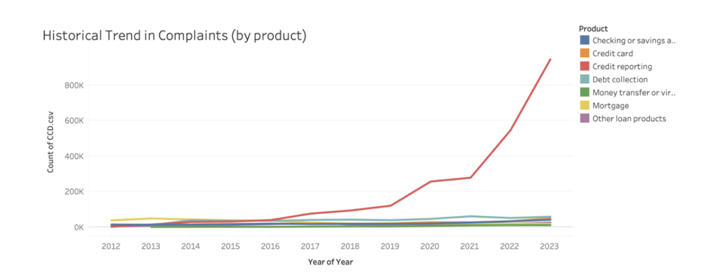
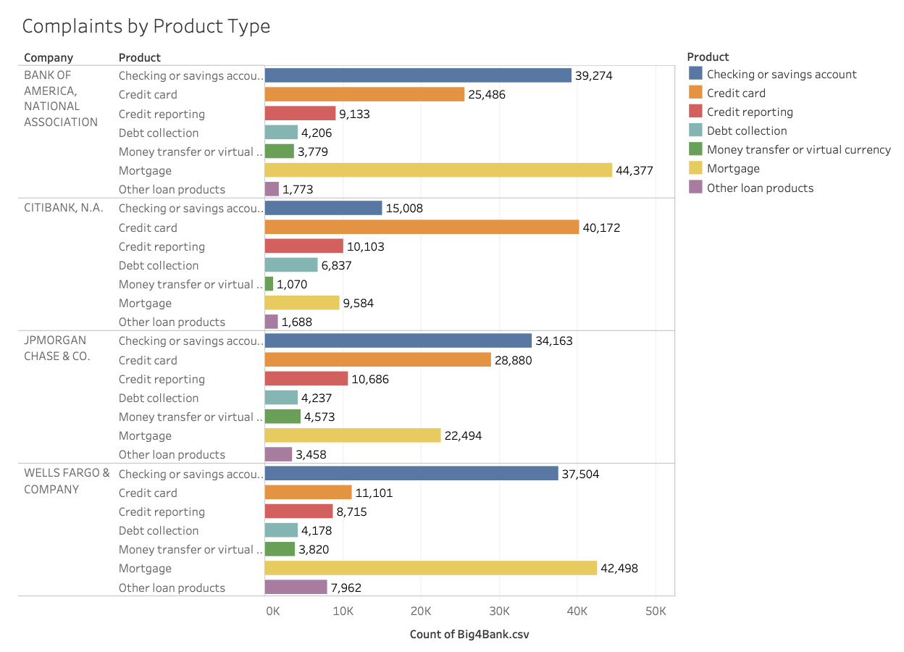
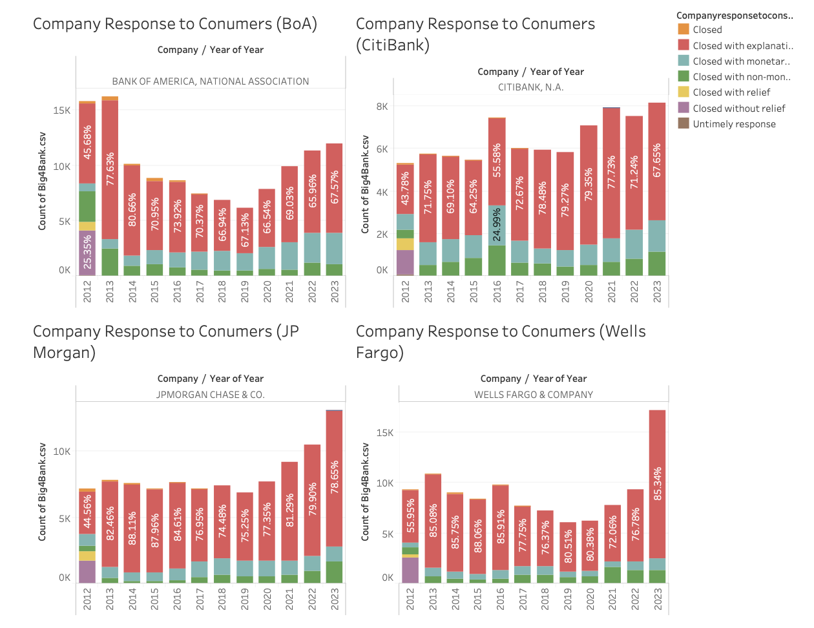
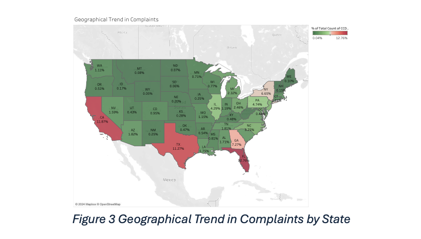

# Customer Complaints Analytics – Banking & Financial Services

## Objective
To analyse large-scale customer complaint data and identify key drivers of dissatisfaction, operational risks, and opportunities to improve customer experience and complaint handling within the banking sector.

## Context
This project was completed as part of a university data analytics case study at the University of Sydney, using publicly available Consumer Financial Protection Bureau (CFPB) complaint data. The analysis simulates a real-world banking analytics scenario, with insights designed to support governance, customer experience, and risk management decisions.

## Duration
4 weeks (end-to-end analytics project)

## Role
Data Analyst (Project-based)
- Led data cleaning, exploratory analysis, and insight generation  
- Designed visualisations and translated findings into business recommendations  
- Contributed to storytelling and final presentation of insights  

## Tools and Methodologies
**Tools:**  
Python (pandas, NumPy), Jupyter Notebook, Excel, Power BI / Tableau  

**Methodologies:**  
Exploratory Data Analysis (EDA), descriptive analytics, trend analysis, segmentation, sentiment and issue-category analysis, visual analytics

## Approach and Process
1. **Data Understanding & Preparation**
   - Loaded and explored 5M+ customer complaint records
   - Cleaned missing, inconsistent, and duplicate data
   - Standardised date, product, and category fields

2. **Exploratory Data Analysis**
   - Analysed complaint volumes by product, issue type, and time
   - Identified trends and spikes linked to operational and service issues
   - Conducted comparative analysis across banks and regions

3. **Insight Generation**
   - Assessed complaint resolution timeliness and outcomes
   - Identified high-risk product and issue categories
   - Focused deep-dive analysis on Bank of America as a case example

4. **Visualisation & Communication**
   - Built charts and dashboards to highlight key trends and risks
   - Translated analytical findings into clear business insights

## Challenges and Solutions
**Challenge:** Extremely large dataset (millions of records) impacting performance  
**Solution:** Filtered and aggregated data efficiently using pandas and staged analysis  

**Challenge:** Unstructured and inconsistent complaint issue descriptions  
**Solution:** Standardised issue categories and applied text-based grouping for analysis  

**Challenge:** Turning descriptive findings into actionable insights  
**Solution:** Framed insights around governance, CX improvement, and operational risk use cases

## Visualisations and Insights
- Complaint volume trends over time highlighted periods of elevated operational stress

- Product- and issue-level breakdowns identified categories driving disproportionate dissatisfaction

- Resolution timeliness analysis showed strong correlation with negative customer outcomes

- Geographic analysis revealed regional complaint concentration, supporting targeted intervention

## End Results

- Identified **key drivers of customer dissatisfaction** across the banking sector, with complaint volume and resolution timeliness emerging as the strongest indicators of negative customer outcomes.
- Found that **specific product categories and issue types** consistently generated disproportionate complaint volumes, indicating structural and process-related weaknesses rather than isolated incidents.
- Demonstrated a clear relationship between **delayed response times and unresolved complaints**, increasing regulatory and reputational risk.
- Highlighted **geographic concentration of complaints**, suggesting the need for targeted operational and service interventions rather than uniform, enterprise-wide responses.
- Provided a focused case analysis on Bank of America to illustrate how complaint analytics can be used to prioritise risk areas and improve customer experience at an institutional level.

## Recommendations

- **Prioritise high-risk products and issue categories** by allocating additional resources to complaint prevention and early resolution in these areas.
- **Improve response-time SLAs** for customer complaints, particularly for high-severity issues, to reduce dissatisfaction and regulatory exposure.
- Implement **proactive monitoring dashboards** to track complaint trends, resolution performance, and emerging risks in near real time.
- Use complaint analytics to **inform customer experience initiatives**, operational process redesign, and frontline staff training.
- Embed complaint data into **governance and reporting frameworks** to support continuous improvement, accountability, and data-driven decision-making.

## Business Value

The analysis demonstrates how customer complaint data can be leveraged as a strategic asset to improve customer experience, strengthen governance, and mitigate operational and reputational risk within financial services organisations.
